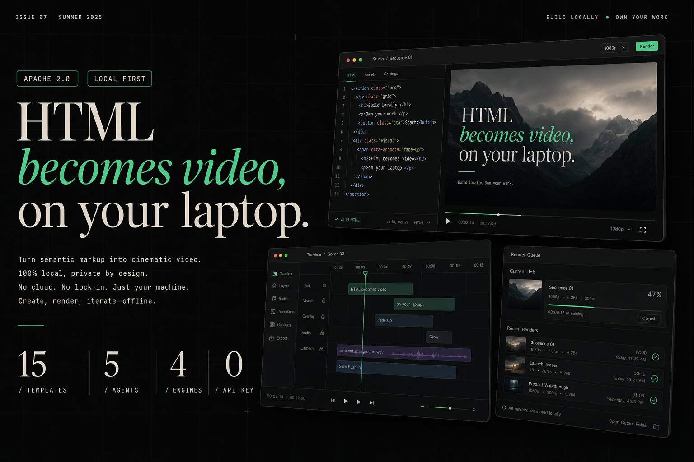
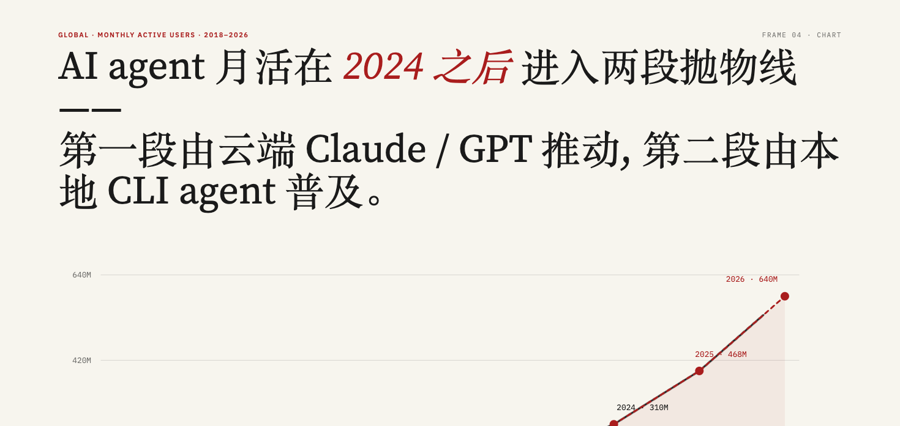
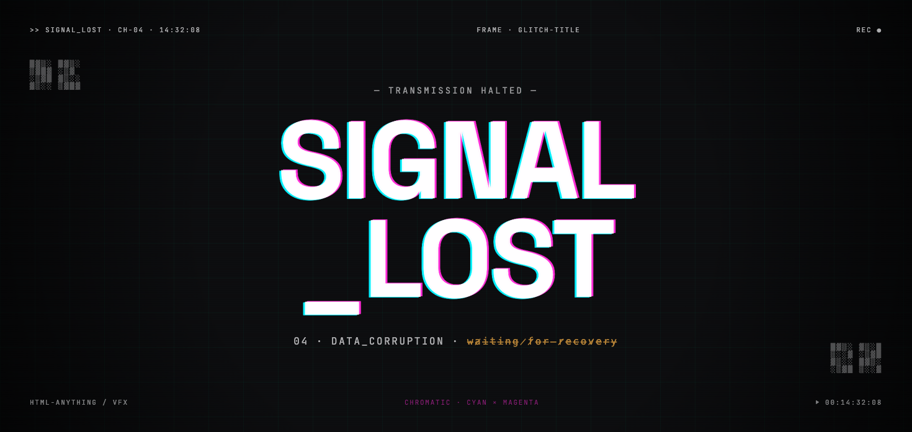
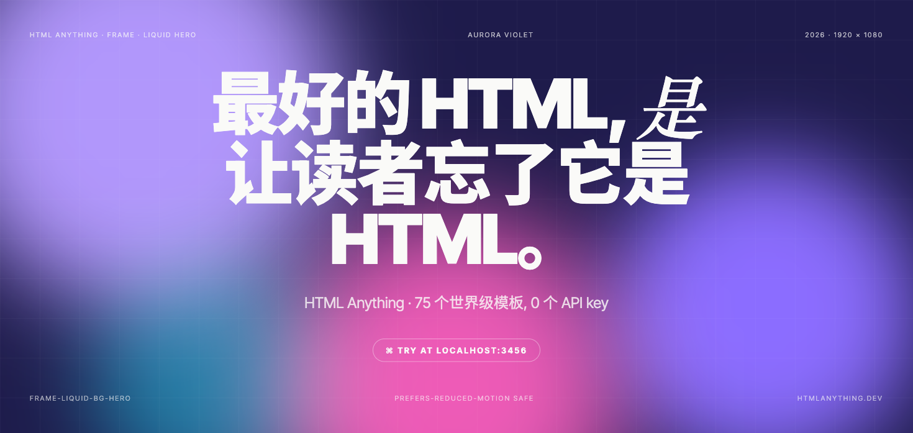
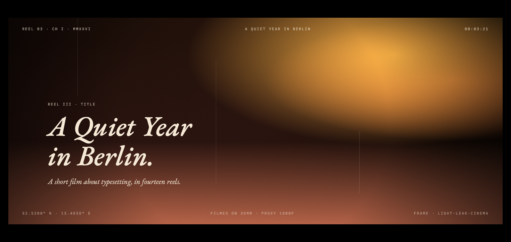
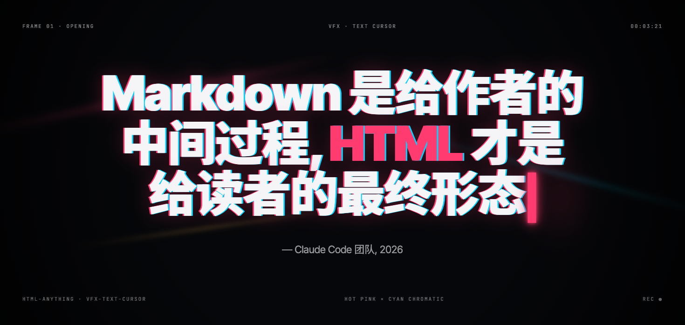
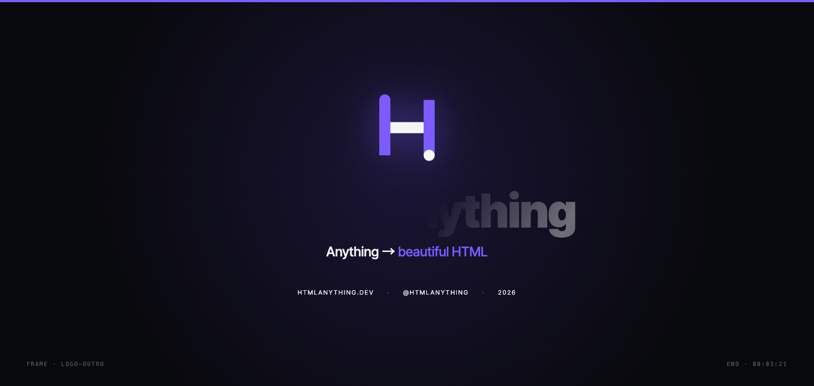

# html-video

<p align="center">
  
</p>

> **在你的电脑上，把 HTML 变成视频。** 接上你本地的 coding agent（Claude Code · Cursor · Codex · Hermes · 或 Anthropic API），描述一个视频，或者**直接粘一个文章链接 / GitHub 仓库**，agent 就把它变成一支多帧、带动画的视频 —— 一个 agent 循环、可插拔渲染引擎、精选模板库、可选 AI 配乐。Apache-2.0，无单次渲染费用，不绑定厂商。

<p align="center">
  <a href="LICENSE"></a>
  <a href="#支持的-agent"></a>
  <a href="#模板库"></a>
  <a href="#把链接变成视频"></a>
  <a href="#配乐"></a>
  <a href="#快速开始"></a>
</p>

<p align="center">
  <a href="https://github.com/nexu-io/open-design#community"></a>
  <a href="https://x.com/nexudotio"></a>
  <a href="https://github.com/nexu-io/open-design"></a>
</p>

<p align="center"><a href="README.md">English</a> · <b>简体中文</b></p>

---

## 作品展示

下面每个模板都是一支真实、带动画的单文件 HTML 视频 —— 这些是实时渲染截图，不是效果图。挑一个，让 agent 填进你的内容，导出 MP4。

<table>
<tr>
<td width="50%"></td>
<td width="50%"></td>
</tr>
<tr>
<td><b>frame-data-chart-nyt</b> · 数据可视化<br/>纽约时报风格的动态折线图 —— 大标题、标注数据点、来源行。适合「数字涨上去了」类叙事。</td>
<td><b>frame-glitch-title</b> · 标题卡<br/>带色彩偏移与扫描线的故障标题。适合开场、爆点、「系统上线」式的能量感。</td>
</tr>
<tr>
<td></td>
<td></td>
</tr>
<tr>
<td><b>frame-liquid-bg-hero</b> · 主视觉<br/>极光液态渐变背景 + 居中大标题。适合产品发布与有力的口号。</td>
<td><b>frame-light-leak-cinema</b> · 电影感<br/>暖色胶片颗粒 + 漏光的电影感画面。适合氛围片、品牌片、叙事短片。</td>
</tr>
<tr>
<td></td>
<td></td>
</tr>
<tr>
<td><b>vfx-text-cursor</b> · 特效<br/>打字机文字 + 闪烁的终端光标。适合代码风揭示、CLI 演示。</td>
<td><b>frame-logo-outro</b> · 片尾<br/>干净的 Logo 动画结束卡。适合任何视频结尾的署名与品牌落版。</td>
</tr>
</table>

……还有 9 个，包括多场景产品宣传、动感排版、瑞士网格数据卡、决策树解说、暖色颗粒杂志风。在 studio 模板库里实时浏览。

---

## 为什么做这个

HTML→Video 是个真实存在的品类 —— 但每个引擎都各有主张，且都要你学*它自己*的创作模型：

| 引擎 | 范式 | 取舍 |
|---|---|---|
| [Hyperframes](https://github.com/heygen-com/hyperframes) | HTML + CSS + GSAP，agent skill 驱动 | 单一渲染范式 |
| [Remotion](https://www.remotion.dev/) | React 组件 | source-available，4 人以上收费 |
| [Motion Canvas](https://github.com/motion-canvas/motion-canvas) · [Revideo](https://github.com/redotvideo/revideo) | canvas 上的 TypeScript 生成器 | 最适合解说类、代码优先 |
| [Manim](https://github.com/3b1b/manim) 等 | 数学 / 3D 优先 | 小众 |

按场景挑引擎、学每一种创作模型、再把它们拼成一条工作流，都要耗真实的工程时间。多数团队挑一个、然后忍受它的局限。

**html-video 是凌驾于它们之上的 meta-layer** —— 你跟 agent 对话，它挑引擎、挑模板、渲染视频。不用学新的 DSL。

---

## 速览

| | |
|---|---|
| **Coding agent（5 个）** | Claude Code · Cursor Agent · Codex CLI · Hermes · Anthropic Messages API —— 在 `PATH` 上自动探测，顶栏一键切换。 |
| **文章 / 仓库 → 视频** | 粘一个 URL 或 GitHub 仓库；studio 在服务端抓取（支持微信公众号文章），用真实内容生成视频。 |
| **15 个模板** | 精选、许可清晰的样式：数据可视化、产品宣传、社媒短片、解说、动感排版、转场 —— 在模板库里实时预览。 |
| **多帧故事板** | content-graph 驱动多场景视频；逐帧改文案、重排、重渲染。 |
| **AI 配乐** | 可选背景音乐 + 旁白（MiniMax），导出时混进 MP4。 |
| **Studio + CLI** | 一个本地浏览器 studio，外加一个可脚本化的 `html-video` CLI。 |
| **许可** | Apache-2.0 —— 无单次渲染费、无席位上限、无贡献者协议。 |

---

## 把链接变成视频

这是大多数人最想要的用法：丢一个链接给 agent，拿回一支视频。agent 本身没有联网能力，所以 studio 在**服务端**抓取来源、把真实内容喂进生成 prompt —— 不用手动复制正文。

```
你：   做一个解读视频  https://mp.weixin.qq.com/s/…
Agent：好，我读完了《用嘴剪视频的时代来了？…》这篇文章 — 这就基于它生成。下一步选风格。
→      一支多帧解说视频，基于文章的真实要点
```

- **网页文章** → 抓取并扁平成 Markdown。像**微信公众号**这种服务端渲染的页面开箱即用。
- **GitHub 仓库** → 通过公开 API 拉取简介、顶层结构、README —— 很适合做「解读某开源项目」的视频。
- **只给一句话** → 描述主题，agent 从零写内容。

无论哪种来源，它都会成为视频真正依据的素材。

---

## 快速开始

```bash
pnpm install
pnpm -r build
node packages/cli/dist/bin.js studio    # 在 http://127.0.0.1:3071 打开 studio
```

在 studio 里：挑一个模板（或直接描述视频 / 粘链接），跟 agent 对话，逐帧改文案，加配乐，导出 MP4。

CLI 工具：

```bash
node packages/cli/dist/bin.js doctor                 # 探测已安装的 agent + 引擎
node packages/cli/dist/bin.js search-templates --intent "github stars race" --top 3
```

---

## 支持的 Agent

在 `PATH` 上自动探测；在 studio 顶栏切换当前 agent。

| Agent | 探测 | 调用 |
|---|---|---|
| **Claude Code** | `claude` | `claude --print`，prompt 走 stdin |
| **Cursor Agent** | `cursor-agent` | `cursor-agent --print` |
| **Codex CLI** | `codex` | `codex exec`，prompt 走 stdin |
| **Hermes** | `hermes` | Hermes ACP CLI |
| **Anthropic API** | BYOK | 直连 Messages API —— 没钉住 CLI 时的默认项 |

没装 CLI？配一个 Anthropic key，studio 直接走 Messages API。

---

## 配乐

给成片加上声音。在 **Settings → Audio** 填入 MiniMax API key，然后在每个项目的 **Soundtrack** 面板：

- **背景音乐** —— 描述一种情绪（`舒缓的电影感氛围，缓慢推进`），MiniMax 生成一段器乐。
- **旁白** —— 输入文案，MiniMax 朗读（TTS）。

两者都会通过 ffmpeg 混进导出的 MP4（音乐压低到人声之下，可选淡入淡出）。没配 key？studio 其余部分照常工作。

---

## 架构

```
packages/
├── core/                  Project / Asset / ContentGraph 类型、registry、orchestrator、
│                          MiniMax provider + ffmpeg 音轨混合
├── content-graph/         多帧故事板中间表示（节点 + 边，拓扑排序）
├── runtime/               Agent 运行时 —— 探测 / spawn / 流式
│                          （Claude · Cursor · Codex · Hermes · Anthropic API）
├── adapter-hyperframes/   首个参考引擎适配器（HTML + CSS + GSAP）
├── cli/                   `html-video` 命令 + studio HTTP server + 来源抓取
└── project-studio/        浏览器 studio UI（对话、模板库、帧、配乐、导出）
templates/                 15 个精选视频模板
research/                  RFC（引擎适配器 / 模板元数据 / agent skill / content-graph）
```

---

## 路线图

- [x] 引擎适配器规范 —— 一个接口，N 个后端
- [x] 模板元数据格式 —— 许可优先、agent 可读
- [x] 多帧故事板工作流（content-graph）
- [x] Studio：实时模板库、agent 切换器、逐帧改文案
- [x] 来源素材：文章 / GitHub 仓库 → 视频
- [x] AI 配乐（MiniMax 音乐 + 旁白），导出时混合
- [ ] 真实 Hyperframes 上游渲染（替换适配器桩）
- [ ] Remotion / Motion Canvas / Revideo 适配器
- [ ] Agent skill 包 + 模板市场

---

## 参考与渊源

| 项目 | 在这里的角色 |
|---|---|
| [Open Design](https://github.com/nexu-io/open-design) | 姊妹项目 —— 设计 agent meta-layer；同一团队、同一理念 |
| [HTML Anything](https://github.com/nexu-io/html-anything) | 姊妹项目 —— 面向*静态*交付物的 HTML；html-video 是*动态*那一面 |
| [Hyperframes](https://github.com/heygen-com/hyperframes) | 首个引擎适配器；HTML+GSAP 渲染范式 |

## 许可

[Apache-2.0](LICENSE)

## 出品

[nexu-io](https://github.com/nexu-io) —— [Open Design](https://github.com/nexu-io/open-design) 背后的团队。加入 [Discord](https://github.com/nexu-io/open-design#community) · 关注 [@nexudotio](https://x.com/nexudotio)。
